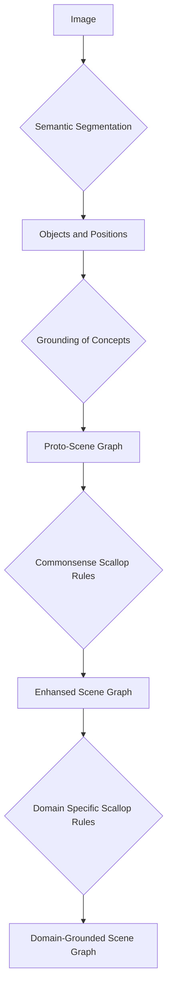

# scene_graph_project
A project for creating useful spatial scene graphs from images. 

## TODO 
- Ego Centric Scene graph (change the perspective of the scene graph to a specific point within the scene)
   - [VLM-Grounder](https://github.com/InternRobotics/VLM-Grounder)
   - [VIZOR](https://vivekmadhavaram.github.io/vizor/)
   - [Vil3DRel](https://arxiv.org/pdf/2211.09646)


## Data sets

- [**Visual Genome**](https://homes.cs.washington.edu/~ranjay/visualgenome/index.html): an ongoing effort to connect structured image concepts to language
- [**ConceptNET**](https://conceptnet.io/): semantic network, designed to help computers understand the meanings of words that people use.
- [**Atomic20/20**](https://github.com/allenai/comet-atomic-2020):
- [**CLEVR**](https://cs.stanford.edu/people/jcjohns/clevr/): a diagnostic dataset that tests a range of visual reasoning abilities
- [Ego4D](https://ego4d-data.org/)
### Car Centric Datasets:
- [BDD-X](https://github.com/JinkyuKimUCB/BDD-X-dataset)
## Rule Mining Links

- [**SAFRAN**](https://github.com/OpenBioLink/SAFRAN): Scalable and fast non-redundant rule application
- [**AnyBURL**](https://web.informatik.uni-mannheim.de/AnyBURL/): rule learner AnyBURL (Anytime Bottom Up Rule Learning). AnyBURL has been designed for the use case of knowledge base completion, however, it can also be applied to any other use case where rules are helpful.
- [**pyClause**](https://github.com/symbolic-kg/PyClause): a library for easy and efficient usage and learning of symbolic knowledge graph rules
```bash
pip install git+https://github.com/symbolic-kg/PyClause.git
```


## Setting up python

```bash
#create virtual environment
python3 -m venv .venv
. .venv/bin/activate
#install dependencies
pip install -e . 
```


## Interesting Links
[**Scallop Interpreting over Graphs**](https://www.scallop-lang.org/log22/slides/log-2022-tutorial-scallop-part.pdf)


## The Idea
1. Copy [REGNUM](https://github.com/armitakhn/REGNUM) as a baseline
   a. test on specifically positional datasets where we take basic predicates like `near`, `far`, `in_contact` etc and convert them into more complex predicates like `wearing`, `holding`,`riding`,`throwing` etc. Because of this we actually can delimit our range for predicates to a positional subset, but how can we do that?  
3. see what needs to be changed or updated
4. make modifications like
  a. soft bounds through distributions
  b.   

### Diagram

